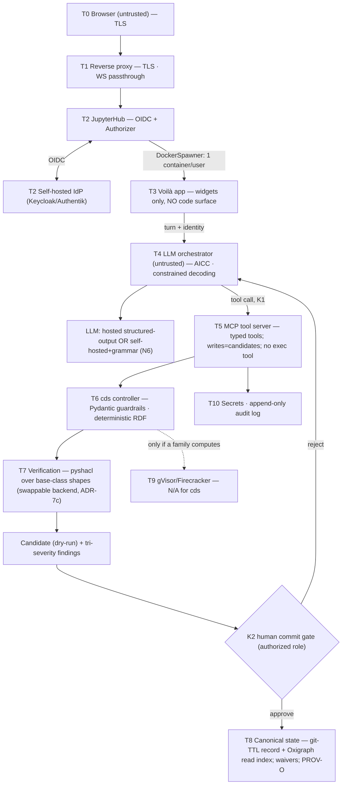

<!-- SPDX-License-Identifier: CC-BY-4.0 -->

# `cds` Web Application — Architecture & Build Specification

**Status:** Draft for review · **Date:** 2026-08-02 · **Prepared for:** M. Zargham (DSG) / Open-MBEE
**Repo:** `Open-MBEE/concept-definition-stage` (`cds`), evolving into a **monorepo** (the `cds` Python package + the web-app build/deploy code)
**Audience:** a human reviewer, and a Claude Code / LLM agent starting a build session *inside the `cds` repo*.
**Self-contained:** yes — this document folds in all prior analysis; no other document is required to act on it.

---

## 0. How to use this document

This is the single source of design truth for turning `cds` — today a local CLI + AI-assisted editor — into a **login-gated web application** in which a *carefully constrained* LLM facilitates authoring a concept definition. It is written so an agent can open it in the repo and start building without re-deriving the design.

Two rules for anyone (human or agent) acting on this spec:

1. **Preserve `cds`'s disciplines** (§1.2). The core is not to be rewritten — the app is a *shell* around it. TTL is never hand-edited; all writes go through the CLI/authoring functions; no canon is ever fabricated.
2. **Every constraint has a named enforcement point** (§3, §5.3). When you build a subsystem, you are discharging specific requirements (K1–K5); the acceptance test for that subsystem *is* the proof the constraint holds. Make constraints explicit, enforce them, prove they were enforced.

**Supersedes:** the earlier split drafts (`reference-physical-architecture.md`, `concrete-physical-architecture-cds.md`, `cds-app-architecture-and-build-plan.md`). This is the canonical consolidation.

---

## 1. Context

### 1.1 What `cds` is today (source-verified, 2026-08-02)

`cds` records the *front end of a project* — mission, goals, objectives, problems/opportunities, drivers/constraints, MoEs, stakeholders, needs — as version-controlled, SHACL-checked RDF, grounded verbatim in **SEBoK "Concept Definition"** and **INCOSE** needs guidance (the GtWR **C1–C15** need characteristics). It is a docs-as-code **MVC**: SKOS+PROV RDF (model), a *tightly constrained* Typer CLI (controller), pluggable views (Markdown brief; Typst→PDF).

| Concern | Real module / fact |
|---|---|
| Controller | `cds.core.cli` (Typer); commands `guide, explain, init, synthesis, new, park, queue, tension, list, show, rm, build, verify, render, compile`; console script `cds = cds.core.cli:main` |
| Write path (choke point) | `cds.core.authoring` — `create_synthesis`, `create_record` (upsert via `_merge_into`), `project_graph`, side-ledgers; **all writes funnel here + `cds.core.workspace`**, explicitly "kept for a future remote (Flexo/MMS) backend and a pyoxigraph store" |
| Model / guardrails | `cds.core.model.instances` / `.notes` — Pydantic `Record`/`Synthesis`/`ParkedItem`/`RetrievalItem`/`Tension`; `KIND_TERM`, `model_for_kind`, `record_iri` |
| Verify | `cds.core.verify.verify(data, *, shapes, waivers, check_conflicts) -> VerifyResult{conforms, findings}`; `Finding{severity, rule, focus, message, tier}`; `Severity` T1/T2/T3; `Waiver` ↔ `cds:Waiver` RDF; `_check_conflicts` (NeedFormShall, NeedWithoutStakeholder, DuplicateStatement, DanglingReference, …). Uses `pyshacl.validate(..., advanced=True, inference="none")` |
| Shapes | `src/cds/ontology/shapes/*.shapes.ttl` — `_shared`, `concept`, `concept-definition-instances`, `notes`, `boundary-object` |
| Canon / ontology | `src/cds/ontology/{cds-core,concept-definition,waivers}.ttl`; ns `cds: https://w3id.org/cds#`, `cdsterm: …/term/` |
| Determinism | `cds.core.serialize.canonical_turtle` (sorted, URIs not blank nodes, stable timestamps) |
| Views | `cds.core.compile.compile_brief` (Markdown); `cds.core.render` (Typst→PDF, **license-keyed**) |
| Two-root model | `cds.core.workspace` — **TOOL_ROOT** (packaged read-only canon) vs **DATA_ROOT** (user repo; `cds.toml` / `CDS_PROJECT`); `Project{root, base_iri, instances_dir, briefs_dir}`; `load_project`, `find_data_root` |
| Interop | `cds.core.flexo` (Flexo MMS Layer-1) + `sysmlv2-python-client` (SysML v2 service), token-gated via `.env` |
| Packaging | **hatchling**, dist `cds`, extras `dev`/`docs`/`interop`; wheel ships ontology + stage YAML + assets; `requires-python >=3.11` |
| Roadmap hooks | **T8** (LLM ergonomics + hosting) — *this app*; **X7** (automated held-out); **T1** (PyPI); **T5** (next stage consumes our output); **X2** (marimo provenance view, deferred) |

### 1.2 Disciplines to preserve (non-negotiable)

- **No fabricated canon.** A `skos:definition`/`cds:quote` holds only verbatim text a human retrieved from a named authority; on unsecured canon the agent **stops and escalates** (retrieval queue / issue); the dependent term is held out of the build.
- **AICC loop:** Ask → Ingest → Confirm → Conform (SHACL-checked).
- **Construction order** (7 stages, each SHACL-T1-gated): Authority → Source (`pending→provided→verified`) → Verbatim (only on `verified`) → Concept+`cds:cites` → Grounded → Admitted to `cds:Synthesis` → Rendered.
- **Dual enforcement:** SHACL governs the RDF; Pydantic governs the tool (write-scope guardrails).
- **Tri-severity + first-class waivers:** T1 `sh:Violation` (fails), T2 `sh:Warning`, T3 `sh:Info`; `cds:Waiver` append-only, suppresses only T2/T3, never T1.
- **Determinism:** byte-stable Turtle; build idempotence.
- **License-keyed views:** verbatim canon lives in the M layer as a guard; the V layer cites-only unless `text_license` is compatible.
- **TTL is never hand-edited.** The CLI/build is the only writer.

---

## 2. What we are building

A login-gated web app around **the unchanged `cds` core**, embodying the principle already doctrinal across your work:

> **The LLM proposes; the substrate verifies; the human commits.** Nothing the LLM does reaches canonical state except as a *candidate* that passed schema + SHACL gates and an explicit human approval.

It is the concrete realization of ROADMAP **T8** (refined from *multi-tenant* to **self-hosted single-tenant**), and it forces the **X7** decision in favor of *automated held-out*. The app adds a **shell** — web surface, login, per-user isolation, an LLM tool boundary, a candidate→commit gate, provenance — not a new engine.

---

## 3. Requirements

### 3.1 Constraint register K1–K5 (normative — the spine)

| # | Requirement (SHALL) |
|---|---|
| **K1** | **Tool/CLI whitelist.** The LLM SHALL reach the system only through a fixed, enumerated set of sanctioned tools. No general code/file/network/shell affordance is exposed to the model. |
| **K2** | **Human-in-the-loop commit.** LLM output SHALL land as a candidate; no LLM-originated change reaches canonical state without an explicit approval by an authorized role. |
| **K3** | **No arbitrary code execution.** No end user *and no LLM* SHALL execute free-form code in the app; any required computation runs in an isolated least-privilege service, never in the app or with its credentials. |
| **K4** | **Full audit + provenance.** Every LLM action and state transition SHALL be logged as attributable (user+session+model+version), append-only, replayable; provenance is first-class. |
| **K5** | **Ontological-model conformance.** LLM output SHALL be bound to the family's abstract base classes and rejected unless it conforms — structurally (schema) and semantically (`cds verify`/SHACL) — before a human approves it. For `cds` this includes the content rule: a definition may exist only if it traces to a *verified* source (the verbatim-in-M guard). |

### 3.2 Non-functional requirements

| # | Requirement |
|---|---|
| **N1** | Self-hosted, single-tenant; no mandatory third-party data-plane. (Hosted LLM API permitted; see N6.) |
| **N2** | Login-gated; identity established at one auditable point. |
| **N3** | Determinism preserved (byte-stable Turtle; build/commit idempotence). |
| **N4** | Correctness over speed; canonical state always valid (the guarantee lives at the commit gate — §6.4). |
| **N5** | The app definition is itself a versioned, reviewed artifact (docs-as-code). |
| **N6** | LLM-locality is a deployment variable: hosted structured-output API **or** self-hosted model, behind the same tool boundary. |
| **N7** | **Interactive latency budget.** An authoring turn's feedback SHALL meet a stated budget (target: cheap structural feedback < ~150 ms; full verify at a choke point, async, target < ~2 s on a realistic graph). Verification strategy is chosen to meet this (§7). |

---

## 4. Architecture decisions (ADRs)

> **ADR-1 — Notebook substrate: JupyterHub + Voilà.** Voilà renders the app notebook (no code surface — front-end execute disallowed by default); JupyterHub gives native OIDC (`GenericOAuthenticator`) + per-user container isolation (`DockerSpawner`). **Chosen for** closing the code surface by construction (K3), **familiarity to the scientific/engineering computing community** (the systems engineers who operate and review this already live in Jupyter), strongest isolation, native OIDC, deepest track record. **Cost:** heaviest ops; `.ipynb` is JSON (keep the notebook thin). **Alternative on file:** marimo `run` (cleaner `.py`, lighter) — deferred; the constraint stack is substrate-independent, so a later swap touches only the app tier.

> **ADR-2 — Authentication: self-hosted OIDC** (Keycloak primary; Authentik alternative). Honors N1; realm roles drive RBAC/personas and the K2 commit authority. WorkOS AuthKit retained as managed fallback.

> **ADR-3 — Constraint stack: three gates + a tool boundary + a commit gate.** Constrained decoding → deterministic RDF → `cds verify` (SHACL over abstract base classes); the LLM acts only via the MCP whitelist; canonical writes pass a human commit gate. No single layer trusted alone.

> **ADR-4 — Monorepo + packaging.** The repo is a **monorepo**: the `cds` **pip-installable Python package** (`src/cds/…`, unchanged core + new subpackages) **plus** the web-app build/deploy code (`deploy/…`, infra-as-code, not shipped in the wheel). The app subsystems ship as **extras** of the existing `cds` hatchling distribution (`cds[mcp]`, `cds[facilitator]`, `cds[app]`) with new console scripts. **The MCP tool server (`cds.mcp`) is the pip-installable subsystem** — `pip install "cds[mcp]"` yields a reusable, versioned tool server (also what ROADMAP T8b's local-LLM hosting reuses); `pip install cds` stays a lean CLI. Rationale: matches the repo's established extras convention (`interop` already pulls `sysmlv2-python-client`), one distribution/version. *(Alternative: a sibling `cds-app` distribution — documented, not chosen; revisit only if web deps must be fully out of core metadata.)*

> **ADR-5 — Candidate/commit gate reuses the existing I/O choke point.** MCP write tools author into a **session staging `Project`** (a scratch DATA_ROOT); `cds verify` runs on the staging graph; `cds_commit` merges staging → canonical via the same `authoring` functions + a git commit stamped with PROV-O. This is exactly the extension point `workspace`/`authoring` reserve — no core rewrite.

> **ADR-6 — Resolve X7 as automated held-out.** In the app, a term whose cited source is not yet `verified` is **held** (surfaced T2 + report line), never committed and never allowed to fail the whole build. This makes "no fabricated canon" a structural dead-end for the LLM, not a matter of discipline. (Standalone CLI keeps manual incrementality for v0.1; the app requires the automated form.)

> **ADR-7 — Storage & verification strategy.**
> **(a) Store.** **git-TTL is the system of record** (determinism, reviewable diffs, git-as-audit). **Oxigraph (pyoxigraph) is a derived, rebuildable read/SPARQL/persistence index** — persistent store for the canonical read model, in-memory store for per-session staging. Oxigraph accelerates reads/`compile`/cross-refs and the SysML v2 / Flexo joins (~20–37× SPARQL vs rdflib). **Oxigraph does *not* validate** (it has no SHACL) and pyshacl's per-term traversal is *slower* through Oxigraph's Python API — so **the graph pyshacl validates is a materialized in-memory rdflib delta**, not the Oxigraph store.
> **(b) Verification timing — verify-on-request with choke points.** Cheap structural/Core checks run inline (Pydantic `model_for_kind` + fast checks) for responsive feedback (N7). The **full SHACL pass** (`advanced=True`, `sh:sparql`) runs at **defined choke points**: the **dry-run preview** (on request) and the **commit gate** (mandatory, hard, non-waivable T1). Interactive turns validate only the **staging delta** (pyshacl focus-node + shape-subset "targeted mode"), with a **warm shapes graph** (parsed once), run **async off the request thread** (process pool). Full canonical-graph verify runs in CI. **The guarantee lives at the commit gate:** staging is a draft space (may hold invalid intermediate states); canonical state is only mutated at commit, where full verify gates — so N4 holds ("the commit is the assertion").
> **(c) Verifier backend is swappable behind a frozen contract.** `verify()`'s `VerifyResult`/`Finding` signature is the contract; **pyshacl is the reference implementation and current engine**. A future Rust-executing fast-path (a mature Oxigraph-compatible SHACL validator, or a SHACL→SPARQL-on-Oxigraph compiler) is **deferred** (§11) and, when adopted, MUST pass a **W3C-suite + differential-vs-pyshacl parity harness** before it is trusted for any shape.

> **ADR-8 — LLM locality (N6).** Default to a hosted structured-output/tool-use API (least infra); self-hosted vLLM + grammar-constrained decoding is an optional extra for air-gap/sovereignty. The tool boundary and gates are identical either way.
> *(P1 amendment — bring-your-own-LLM.)* Two BYO paths, neither adding end-user UX: **(a) MCP path** — `cds-mcp` is BYO-LLM *by construction*: the model lives in whichever MCP client connects (Claude Code/Desktop, a local Ollama-backed host, …); cds holds no LLM credential (this is T8b). **(b) Web-app path** — the facilitator's `decode.py` (P4) holds exactly one server-side client behind an **OpenAI-compatible endpoint triplet** (`base_url`, `model`, `api_key` — covers Anthropic/OpenAI/OpenRouter/Azure and self-hosted Ollama/vLLM/llama.cpp), set as **operator config** (env/deploy secrets, `cds-admin` persona). End users never see a model picker; swapping providers is editing three values; the K-gates are provider-independent.

---

## 5. Reference architecture (abstract)

Ten tiers; the trust boundary tightens downward.



### 5.3 Enforcement traceability (the contract)

| # | Enforcing tier(s) | Mechanism | Proof hook (acceptance test) |
|---|---|---|---|
| K1 | T5 (+T4) | Enumerated MCP tools; no exec/file/net tool | served manifest == whitelist; non-whitelisted call refused |
| K2 | T8 gate (+T2 role) | candidate→canonical only via commit gate bound to a role | candidate cannot mutate canonical branch without an authorized approval |
| K3 | T3 (+T9) | Voilà execute disabled; per-user container; **no compute path in cds** | no code affordance renders; container non-root/drop-caps/egress-restricted |
| K4 | T4/T6/T8/T10 | PROV-O per commit; append-only invocation log; model+version stamped | every canonical triple carries provenance; audit replays a session |
| K5 | T4 (structural) + T7 (semantic) | schema-bound tool args → deterministic RDF → SHACL over base-class shapes; T1 auto-reject; verbatim-in-M guard; held-out | base-class/verbatim violation → T1 pre-human; held term excluded from commit |

---

## 6. Concrete architecture for `cds`

### 6.0 Six-component decomposition & contract seams *(owner-approved P1 amendment, 2026-08-02)*

The system is factored into **six components, each a would-be distribution, joined only by typed
contracts** (`cds.contracts`, which imports only `cds.core`). Any component can move
out-of-process without changing its consumers. Doctrine (from the internal eBike design corpus
and RIME ai-authoring): **verification** is the machine question "did we build it right?"
(oracle, SHACL); **validation** is the human question "did we build the right thing?" (the K2
commit gate); the two are never conflated in either direction. Facilitation is a bounded assist
layer — "e-bike-style": the human steers — whose substance is the constrained authoring
protocol, not the LLM.

| # | Component | Package / surface | Role |
|---|---|---|---|
| C1 | Modeling-family package | `cds.core` + `cds.stages` + `cds` CLI | the model family + CLIs to build/check models; Sphinx-documented |
| C2 | Conformance oracle service | `cds.oracle` · `cds-oracle` · extra `oracle` | stateless: model instance in → verdict + granular tri-severity findings (rule/focus/message) for remediation; OpenAPI committed |
| C3 | Facilitator service | `cds.facilitator` · `cds-serve` · extra `facilitator` | **correct-by-construction authoring**: the K1 tool registry mounted as HTTP routes over a session staging Project; graded strictness (advisory checks while composing; the commit gate blocks); P4 adds the AICC/LLM sidecar as a UX affordance over this same API; OpenAPI committed |
| C4 | Model datastore service | contract `cds.contracts.ModelStore` (= `cds.core.flexo.FlexoBackend`) | stores model instances per branch; local git-TTL layout is the reference impl; **Flexo MMS** is the deployment target (ROADMAP T6); own docs page |
| C5 | MCP tool server | `cds.mcp` · `cds-mcp` · extra `mcp` | the K1 whitelist as an MCP/stdio transport for LLM orchestrators; composes C1 (in-process) + C2 (via `ConformanceOracle`) + C4 (via `ModelStore`) |
| C6 | Web app | `cds.app` (P5/P6) | Jupyter/Voilà front end driving the facilitator service |

Process-grammar mapping (eBike lifecycle vocabulary): `Q` (query/lookup) = C4, `DC`
(deterministic compute) = C2, `LLM` + `HI` (human input) = C3/C6.

### 6.1 Reference tier → concrete component

| Ref tier | Concrete for `cds` |
|---|---|
| T1 Edge | Traefik (TLS, WS passthrough) |
| T2 Identity | **Keycloak** realm `dsg` + **JupyterHub** `GenericOAuthenticator`; realm roles → personas (§6.5) |
| T3 App | `DockerSpawner` → per-user `cds-app` image: **Voilà** + `concept_definition_app.ipynb` + `cds[app]` + `ipywidgets` chat/forms/brief-preview |
| T4 Orchestrator | `cds.facilitator` — layered: **P1** the non-LLM facilitation API (`cds-serve`, C3 — the constrained authoring routes); **P4** the AICC loop + LLM sidecar as a UX affordance over that same API (LLM per ADR-8) |
| T5 Tool boundary | **`cds.mcp`** — whitelisted typed wrappers over `authoring`/`verify`/`explain`/`compile`; candidate-producing; **no exec tool**; the registry (`cds.mcp.tools`) is transport-neutral and is mounted by both `cds-mcp` (MCP/stdio) and `cds-serve` (HTTP) |
| T6 Controller | `cds.core` — **unchanged**; Pydantic guardrails intact |
| T7 Verification | `cds.core.verify` behind the swappable backend contract (pyshacl reference); staging-delta targeted, warm, async (ADR-7); exposed out-of-process as the **conformance oracle service** (`cds.oracle`, C2) via the `ConformanceOracle` contract |
| T8 Canonical | per-analysis **git repo of `concept-definition/instances/*.ttl`** (record) + **Oxigraph read index**; `cds:Waiver` append-only; **PROV-O**; commit gate |
| T9 Sandbox | **N/A** — cds authors records, not computations; no user-code execution exists to sandbox (K3 satisfied twice over) |
| T10 Cross-cutting | Secrets (SOPS/1Password-CLI); append-only audit; access-controlled **held-canon store** (SEBoK/GtWR PDFs — REFERENCE tier, never vendored) |

### 6.2 Topology

```mermaid
flowchart TB
    U["Browser (TLS)"] --> TR["Traefik"] --> HUB["JupyterHub · GenericOAuthenticator → Keycloak · DockerSpawner"]
    HUB <-->|OIDC| KC["Keycloak realm 'dsg'"]
    HUB --> APP
    subgraph APP["per-user container 'cds-app' (isolation boundary)"]
        VOI["Voilà — concept_definition_app.ipynb (chat · forms · brief/verify preview; no code)"]
    end
    VOI -->|turn + identity| FAC["cds.facilitator (AICC: Ask→Ingest→Confirm→Conform)"]
    FAC --> LLM["LLM (hosted structured-output OR self-hosted+grammar)"]
    FAC -->|tool call (K1)| MCP["cds.mcp — whitelist · candidates only"]
    MCP --> CORE["cds.core.authoring/verify (unchanged) · canonical_turtle"]
    CORE --> STAGE["session staging Project (scratch DATA_ROOT; in-mem Oxigraph read)"]
    STAGE --> VER["verify() — staging-delta, warm, async (pyshacl reference backend)"]
    VER --> DRY["dry-run brief + tri-severity findings"]
    DRY --> GATE{"commit gate (K2) — role cds-reviewer · FULL verify (hard T1)"}
    GATE -->|approve| CANON["canonical git repo: concept-definition/instances/*.ttl"]
    CANON --> OXI["Oxigraph read index (derived, rebuildable)"]
    CANON --> PROV["PROV-O provenance + append-only audit (K4)"]
    CANON --- WV["cds:Waiver (append-only, T2/T3 only)"]
    FAC -.->|unsecured canon| RQ["cds_queue_add (retrieval) — STOP + escalate (no fabrication)"]
    MCP -.->|token-gated| FX["Flexo MMS / SysML v2 service"]
    HELD["held-canon store (SEBoK/GtWR)"] --> CORE
```

### 6.3 Golden path (one authoring turn)

`Ask` (Voilà widget → facilitator; no code) → `Ingest` (resolve canon; if unsecured, `cds_queue_add` + **stop**) → `Confirm` (verbatim verified vs held authority; content-hash) → `Conform` (facilitator emits `cds_new_<kind>` **candidate** into the staging Project; construction order + `canonical_turtle`) → **staging-delta verify** (targeted, warm, async; T1 auto-rejects + regenerates; T2/T3 surface) → dry-run brief → **authorized human approves** → `cds_commit` runs **full verify** then merges staging→canonical + git commit stamped PROV-O. The LLM is upstream of every gate, downstream of none.

### 6.4 Where the guarantee lives

Staging is a **draft space** — intermediate invalid states are allowed; interactive checks are advisory. The **canonical graph is always valid** because the *only* path that mutates it is `cds_commit`, which runs the **full, hard SHACL verify** (unwaived T1 blocks). "Verify at assertion time" (N4) is preserved by defining *the commit as the assertion*.

### 6.5 Roles → authorization (Keycloak realm roles)

| Role | Persona | May |
|---|---|---|
| `cds-facilitator-user` | Facilitator user | run the AICC interview; produce candidates; park/queue/tension; file retrievals. **Cannot commit.** |
| `cds-reviewer` | Reviewer/approver | + `cds_commit` (K2); resolve tensions; add T2/T3 waivers with reason. |
| `cds-canon-steward` | Canon steward | secure/verify authorities & sources (`pending→provided→verified`); manage held-canon store. |
| `cds-admin` | Operator | deploy; set `text_license`/`code_license`; realm & secrets. |

Separation of duties: a facilitator proposes but cannot commit; a canon steward gates what verbatim may exist; an approver gates what enters canonical state.

---

## 7. Monorepo layout & packaging

```
concept-definition-stage/                    # monorepo
├── pyproject.toml                           # the cds distribution (hatchling) + extras
├── src/cds/
│   ├── core/  stages/  ontology/  fixtures/ # S1 — existing package, UNCHANGED (T6/T7 engine)
│   │   └── verify.py                        #   frozen validate() contract; pyshacl reference backend (ADR-7c)
│   ├── contracts/    __init__.py                                                # C-seams — ConformanceOracle · ModelStore (imports only core)
│   ├── mcp/          __init__.py server.py tools.py staging.py provenance.py manifest_doc.py  # S2/C5 — tool boundary (K1/K2/K4); tools.py = transport-neutral registry
│   ├── oracle/       __init__.py app.py export_openapi.py                       # C2 — stateless conformance oracle (/verify /rules /healthz)
│   ├── facilitator/  __init__.py aicc.py prompts.py decode.py server.py export_openapi.py  # S3/C3 — P1 authoring API (cds-serve); P4 AICC agent (T4)
│   └── app/          __init__.py widgets.py commit_gate.py notebook/concept_definition_app.ipynb  # S4/C6 (T3)
├── deploy/                                   # S5 — infra-as-code (NOT in the wheel)
│   ├── docker-compose.yml  jupyterhub_config.py  keycloak/realm-dsg.json  traefik/
│   └── images/ (cds-app Dockerfile, hub Dockerfile)
├── tests/
│   ├── unit/  (existing) + test_mcp_whitelist.py test_staging_commit.py test_provenance.py test_held_out.py
│   ├── app/   test_voila_no_exec.py test_container_hardening.py
│   ├── verify/ test_backend_contract.py test_pyshacl_parity_w3c.py   # backend-swap parity harness (ADR-7c)
│   └── interop/ (existing Flexo/SysML)
└── docs/architecture/cds-web-app.md          # THIS document
```

`pyproject.toml` additions:

```toml
[project.optional-dependencies]
# existing: dev, docs, interop
mcp         = ["mcp>=1.0"]                                                  # S2/C5 (lean, reusable)
oracle      = ["fastapi>=0.110", "uvicorn>=0.29"]                           # C2 — conformance oracle service
facilitator = ["cds[mcp]", "fastapi>=0.110", "uvicorn>=0.29", "anthropic>=0.40", "instructor>=1.0"]  # S3/C3 (service substrate + hosted-LLM default, ADR-8; LLM deps lazy)
selfhosted-llm = ["vllm>=0.6", "xgrammar>=0.1"]                            # N6 sovereign option
app         = ["cds[facilitator]", "voila>=0.5", "ipywidgets>=8", "jupyterhub>=5", "dockerspawner>=13", "oauthenticator>=17"]
store       = ["pyoxigraph>=0.4", "oxrdflib>=0.4"]                          # ADR-7a read index (optional)

[project.scripts]
cds        = "cds.core.cli:main"           # existing — unchanged
cds-mcp    = "cds.mcp.server:main"          # S2/C5 — MCP transport
cds-serve  = "cds.facilitator.server:main" # S3/C3 — facilitation (authoring) API
cds-oracle = "cds.oracle.app:main"         # C2 — conformance oracle
```

`pip install cds` → lean CLI. `pip install "cds[mcp]"` → the reusable tool server. `pip install "cds[app]"` → the full deployable app. `deploy/` is infra, versioned in the monorepo but never shipped in the wheel.

---

## 8. Interface contracts (build these first; they pin the design)

### 8.1 The MCP tool whitelist (K1) — grounded in real `cds` functions

`cds.mcp` exposes exactly these, each a typed wrapper over an existing function; nothing else:

| Tool | Wraps | Effect |
|---|---|---|
| `cds_explain`, `cds_list`, `cds_show` | `explain`, `authoring.list_records`, `authoring.show_record` | read-only |
| `cds_verify`, `cds_compile` | `verify.verify`, `compile.compile_brief` | preview only (on staging) |
| `cds_synthesis`, `cds_new`, `cds_edit` | `authoring.create_synthesis`, `create_record` | **candidate** into staging — never canonical |
| `cds_queue_add`/`set`, `cds_park_add`, `cds_tension_add`/`resolve` | authoring side-ledgers | session hygiene; `cds_queue_add` = **mandated dead-end** on unsecured canon |
| `cds_waive` | `verify.Waiver` → `waiver_to_graph` | append-only; **T2/T3 only**; refused on a T1 |
| `cds_commit` | staging→canonical merge + git + full verify | **gated**: refused unless caller holds `cds-reviewer` |

No `run_python`, `read_file`, `write_file`, `shell`, `http_get`. This table *is* the model's entire reachable surface — `test_mcp_manifest_equals_whitelist` asserts it.

*(P1 amendment.)* The whitelist is **transport-independent**: `cds.mcp.tools` is the single
registry, mounted by both the MCP server (`cds-mcp`, stdio — for LLM orchestrators) and the
facilitator service (`cds-serve`, HTTP — for UIs/scripts), drift-guarded on each
(`test_mcp_manifest_equals_whitelist`, `test_facilitator_api::test_tool_routes_equal_whitelist`).
The conformance oracle is a **separate, smaller surface**: exactly `POST /verify`, `GET /rules`,
`GET /healthz` (`test_oracle_api::test_surface_is_exactly_three_routes`).

### 8.3 Cross-component contracts (`cds.contracts`) — P1 amendment

```
# cds.contracts — imports ONLY cds.core; the modularity keystone
class ConformanceOracle(Protocol):        # C2 seam ("build it right" — machine)
    def check(self, data: Graph, *, check_conflicts: bool = True) -> VerifyResult: ...
class InProcessOracle:                    # reference impl (wraps cds.core.verify.verify)
    ...
# DEFERRED: an HTTP client impl consuming cds-oracle's /verify — trigger: an
# out-of-process consumer (P5/P6 app tier).

ModelStore = cds.core.flexo.FlexoBackend  # C4 seam: commit(*, branch, graph) / read_graph(*, branch)
# impls: InMemoryFlexoBackend (tests) · git-TTL project layout (durable reference, P2 staging)
#        · FlexoHttpClient (remote — the T6 datastore service target)
```

Committed, drift-checked interface specs: `docs/services/openapi-oracle.json`,
`docs/services/openapi-facilitator.json`, `docs/services/mcp-manifest.md` — regenerating each
must be byte-identical (same discipline as the TTL determinism gate).

### 8.2 The verification backend contract (ADR-7c) — designed swappable now, Rust deferred

Freeze the public signature; make the engine pluggable behind it:

```
# cds.core.verify  (contract — do not break)
def verify(data, *, shapes=None, waivers=None, check_conflicts=False) -> VerifyResult: ...

# internal: a backend Protocol so the engine can be swapped without touching callers
class VerifierBackend(Protocol):
    def validate(self, data: Graph, shapes: Graph, *, focus=None, shape_subset=None) -> RawReport: ...

class PyShaclBackend:   # reference implementation and current default (advanced=True)
    ...

# DEFERRED (ADR-7c, §11): a Rust/SPARQL-on-Oxigraph backend, adopted ONLY after it passes:
#   tests/verify/test_pyshacl_parity_w3c.py  — W3C SHACL test suite
#   tests/verify/test_backend_differential.py — every input, both engines, canonicalized reports must match
```

The parity harness is a **first-class deliverable now** even though the only backend now is pyshacl — it is the mechanism that lets a Rust engine drop in later *without a leap of faith*. Building it early also hardens the current engine.

---

## 9. Storage & verification strategy (operational detail for ADR-7)

- **Record vs index.** Authoring writes deterministic TTL to `concept-definition/instances/*.ttl` (the git-versioned record) via `authoring` + `canonical_turtle` — *unchanged*. A load step syncs TTL → **Oxigraph** for fast reads/SPARQL/compile/joins. Oxigraph is rebuildable from TTL at any time; if it and git disagree, git wins.
- **Staging = in-memory.** Each session's candidates live in a scratch `Project` (its own `instances/`) and an in-memory Oxigraph/rdflib graph. Small, so verify over it is cheap.
- **Verify cadence.**

| When | What runs | Cost | Blocking? |
|---|---|---|---|
| Per keystroke/field | Pydantic model validation (`model_for_kind`) | ~free | inline |
| Per authoring turn | staging-delta SHACL (targeted focus-nodes + shape subset), warm shapes, in a process pool | small | **async**, non-blocking; advisory |
| Dry-run preview (on request) | full staging SHACL + `_check_conflicts` | moderate | on request |
| **Commit gate (K2)** | **full SHACL (`advanced=True`), hard** | moderate | **blocks the commit only** |
| CI | full canonical-graph verify + determinism + parity harness | batch | CI gate |

- **Do not** route the graph pyshacl validates through Oxigraph (per-term traversal is slower there); materialize a small in-memory rdflib graph for validation. Use Oxigraph for the *read/SPARQL* side.
- **Backend swap** stays behind §8.2's contract + parity harness.

---

## 10. Build plan (development branch, TDD)

**Branch:** `feat/t8-concept-definition-app` off `main`. Each phase is a shippable PR into the branch with its own passing tests; merge to `main` only when P6's gate is met. Tests precede implementation (specified against the REQ table).

| Phase | Goal | Key work | Acceptance gate | Trace |
|---|---|---|---|---|
| **P0** | Scaffold & contracts | branch; empty `cds.mcp/facilitator/app` + extras + scripts; **freeze `verify()` contract + stand up the parity harness (pyshacl vs W3C suite)**; CI extended; land this doc | `pip install -e ".[mcp]"` imports; `cds-mcp --help`; existing suite green; parity harness green on pyshacl | N5, ADR-7c |
| **P1** | MCP tool boundary (K1) | `cds.mcp.server`+`tools.py` over unchanged core; enumerated manifest; **no exec tool** | `test_mcp_manifest_equals_whitelist`, `test_no_exec_tool`; tools drive a full authoring session | **K1** |
| **P2** | Staging + commit gate (K2) + held-out + Oxigraph read index | `staging.py`; `commit_gate.py` (approver-gated merge + git + full verify + held-out filter); optional Oxigraph sync for reads | `test_candidate_isolated_in_staging`, `test_commit_requires_approver`, `test_held_out_pending_term`, `test_deterministic_commit_diff` | **K2, K5, N3, X7** |
| **P3** | Provenance + audit (K4) | `provenance.py` (PROV-O per candidate/commit: user+session+model+version); append-only audit | `test_every_canonical_triple_has_provenance`, `test_audit_append_only_replay` | **K4** |
| **P4** | Facilitator / AICC | `aicc.py`+`prompts.py` (server-side skill) + `decode.py` (Instructor/Pydantic; optional vLLM+XGrammar); mandated `cds_queue_add` dead-end | `llm-ergonomics` eval (T8a): scored no-fabrication + construction-order; `test_unsecured_canon_escalates` | **K5, K1**, T8a |
| **P5** | Voilà app + no-exec (K3) + verify UX | `concept_definition_app.ipynb` + `widgets.py`; Voilà execute disabled; async staging-delta verify wired to the UI (N7) | `test_voila_execute_disabled`, `test_no_code_widget`; UAT author a mapping end-to-end; latency budget met | **K3, N7** |
| **P6** | Auth, isolation, deploy | `deploy/`: Keycloak realm+roles; JupyterHub `GenericOAuthenticator`+`DockerSpawner`; Traefik (TLS, WS); container hardening; `docs/hosting-{local,web}.md` | `test_container_hardening`; login→spawn→author→commit smoke; WS kernel path validated | **N1, N2, K3**, T8b/c |

Local-LLM hosting (T8b) falls out of P1+P4: `pip install "cds[mcp]"` + a local model reuses S2 unchanged — documented in `docs/hosting-local.md`.

**TDD requirement specifications (test-first, traceable):**

| REQ | SHALL | Trace | Test |
|---|---|---|---|
| K1.1 | `cds.mcp` serves only the whitelist | K1 | `test_mcp_manifest_equals_whitelist` |
| K1.2 | no code/file/net/shell tool exists | K1/K3 | `test_no_exec_tool` |
| K2.1 | candidate never reaches canonical `instances/` except via `cds_commit` | K2 | `test_candidate_isolated_in_staging` |
| K2.2 | `cds_commit` refused without `cds-reviewer` | K2 | `test_commit_requires_approver` |
| K3.1 | app exposes no code/terminal affordance | K3 | `test_voila_execute_disabled`, `test_no_code_widget` |
| K3.2 | app container non-root, drop caps, restrict egress | K3 | `test_container_hardening` |
| K4.1 | every canonical triple carries PROV-O attribution | K4 | `test_every_canonical_triple_has_provenance` |
| K4.2 | audit log append-only + replayable | K4 | `test_audit_append_only_replay` |
| K5.1 | a `skos:definition` only on a term citing a `verified` source | K5 | `test_verbatim_requires_verified_source` |
| K5.2 | base-class shape violation is a T1 (rejected pre-human) | K5 | `test_base_class_violation_is_T1` |
| K5.3 | a "shall" in a need is flagged | K5 | `test_shall_in_need_flagged` |
| K5.4 | a term citing a non-`verified` source is held out of commit (T2) | K5/X7 | `test_held_out_pending_term` |
| N3.1 | commit produces a byte-deterministic diff; re-commit is a no-op | N3 | `test_deterministic_commit_diff` |
| N7.1 | staging-delta verify meets the interactive budget; full verify runs async off the request thread | N7 | `test_verify_async_offthread`, a latency benchmark |
| V.1 | view compiler emits no restricted verbatim unless `text_license` compatible | K4/license | `test_view_license_keying` |
| VB.1 | any non-reference verifier backend passes W3C-suite + differential parity before use | ADR-7c | `test_pyshacl_parity_w3c`, `test_backend_differential` |
| LLM.1 | facilitator escalates (queue) rather than fabricate on unsecured canon | K5 | `test_unsecured_canon_escalates` |

**CI additions** (extend ROADMAP P1): the `app/` group (Voilà no-exec, container hardening via a built image), the `verify/` parity harness, the `llm-ergonomics` eval (skip-if-no-creds), and a manifest-drift check (served tool list == committed whitelist).

---

## 11. Deferred decisions register (documented, with triggers)

| ID | Deferred | Why now | Trigger to revisit |
|---|---|---|---|
| **D1 — Rust SHACL backend** | Keep pyshacl; design the swappable `VerifierBackend` contract + parity harness now, adopt no Rust engine | No mature, Oxigraph-compatible, `sh:sparql`-complete Rust validator exists (rudof's `sh:sparql` is experimental/endpoint-only; oxirs-shacl doesn't use Oxigraph and is unverified) | A Rust validator reaches W3C-suite parity incl. `sh:sparql` **and** reads an Oxigraph store — **or** benchmarks justify a SHACL→SPARQL-on-Oxigraph fast-path. Then adopt behind the parity harness (VB.1). |
| **D2 — SHACL→SPARQL-on-Oxigraph fast-path** | Not built | pyshacl (targeted/warm/async) is expected to meet N7 for per-project graphs | Benchmarks show pyshacl is the bottleneck on the large canonical / SysML-joined graphs |
| **D3 — marimo substrate** | JupyterHub+Voilà chosen | community familiarity + isolation + native OIDC | If ops weight dominates; the constraint stack (T4–T8) is substrate-independent, so only T1–T3 change |
| **D4 — Multi-tenant hosting** | Single-tenant | operator decision | A multi-tenant need arises (per-tenant isolation, quotas) |
| **D5 — Self-hosted LLM default** | Hosted API default | least infra | Air-gap / data-residency requirement (flip to `selfhosted-llm` extra) |
| **D6 — Sibling `cds-app` distribution** | Extras on `cds` | matches conventions, one version | If web deps must be fully out of core metadata |
| **D7 — Multiplicity / named graphs, next-stage (T5) handoff** | Out of app scope | not required to ship | When T5 (System Requirements) consumes the conformed integrated set |
| **D8 — HTTP `ConformanceOracle` client** | `InProcessOracle` only; the oracle service exists but its consumers are in-process | no out-of-process consumer yet | P5/P6: the app tier (or another service) needs the oracle over the network — implement the client behind the same `cds.contracts` Protocol |
| **D9 — Flexo-backed model-datastore service** | `ModelStore` contract + local git-TTL reference only | ROADMAP T6 owns the live Flexo round-trip; creds-gated | T6 acceptance (Starforge Layer-1 round-trip green) — then `FlexoHttpClient` serves as the store behind the same contract |

---

## 12. Risks

| Risk | Mitigation |
|---|---|
| Prompt injection via tool outputs | minimal typed tool set; validate tool outputs; no exec tool; T4 treated as untrusted (all output passes T5–T8) |
| Facilitator paraphrases canon | verbatim-in-M is a T1; `cds_queue_add` mandated dead-end; canon-steward gate |
| `.ipynb` app-notebook drift | keep it thin; `nbstripout`; substance stays in `cds` `.py`/`.ttl` |
| Oxigraph/git divergence | git-TTL is the record; Oxigraph rebuildable; determinism makes drift detectable |
| Header-spoofed identity / WS auth break | verified JWT to backend; internal tiers proxy-only; WS upgrade passthrough tested |
| Backend-swap correctness regression | no backend trusted without W3C-suite + differential parity (VB.1) |
| Multi-user contention on one analysis repo | per-analysis git repo; `cds_commit` serialization; `cds:tension` for real conflicts; MMS branch-per-proposal option |

---

## Appendix A — `cds` code map (attachment points)

Reuse, don't rewrite: `authoring.create_record`/`create_synthesis`/`project_graph` (staging + commit), `verify.verify`/`VerifyResult`/`Finding`/`Waiver`/`load_shapes` (the backend contract), `workspace.Project`/`load_project`/`find_data_root`/`shapes_dir` (staging root + canon), `serialize.canonical_turtle` (deterministic commit), `compile.compile_brief` + `render` (views), `model.instances`/`model.notes` (Pydantic guardrails), `explain` (read tool), `flexo` + `sysmlv2-python-client` (interop). Ontology: `ontology/{cds-core,concept-definition,waivers}.ttl` + `shapes/*.shapes.ttl`. Do **not** import SysML libraries wholesale — anchor by equivalence axioms (existing pattern). Do **not** hand-edit TTL.

## Appendix B — External sources (2025–2026)

JupyterHub [authenticators](https://jupyterhub.readthedocs.io/en/stable/reference/authenticators.html) · [DockerSpawner](https://github.com/jupyterhub/dockerspawner); [Voilà](https://github.com/voila-dashboards/voila/blob/main/README.md); [Keycloak vs ZITADEL](https://www.cerbos.dev/blog/keycloak-vs-zitadel) · [Authentik vs Keycloak](https://www.cerbos.dev/blog/authentik-vs-keycloak-selfhosted-idp-comparison); [oauth2-proxy](https://github.com/oauth2-proxy/oauth2-proxy); [gVisor](https://gvisor.dev/docs/architecture_guide/intro/); [vLLM structured decoding](https://vllm.ai/blog/2025-01-14-struct-decode-intro) · [XGrammar](https://arxiv.org/pdf/2411.15100) · [Instructor](https://python.useinstructor.com/); [pySHACL](https://github.com/RDFLib/pySHACL) · [SHACL](https://www.w3.org/TR/shacl/) · [W3C SHACL test suite](https://w3c.github.io/data-shapes/data-shapes-test-suite/) · [PROV-O](https://www.w3.org/TR/prov-o/); [Oxigraph](https://github.com/oxigraph/oxigraph) · [Oxigraph perf #1092](https://github.com/oxigraph/oxigraph/discussions/1092) · [oxrdflib](https://github.com/oxigraph/oxrdflib); [rudof `sh:sparql` status](https://raw.githubusercontent.com/rudof-project/rudof/master/CHANGELOG.md) · [Oxigraph SHACL deferred #55](https://github.com/oxigraph/oxigraph/issues/55) · [Trav-SHACL](https://sdm-tib.github.io/Trav-SHACL/); [MCP security (arXiv 2503.23278)](https://arxiv.org/html/2503.23278) · [NSA/CISA MCP CSI](https://www.nsa.gov/Portals/75/documents/Cybersecurity/CSI_MCP_SECURITY.pdf); marimo (deferred alternative) [apps](https://docs.marimo.io/guides/apps/) · [CVE-2026-39987](https://www.endorlabs.com/learn/root-in-one-request-marimos-critical-pre-auth-rce-cve-2026-39987).

---

*Grounded in a source-level review of `Open-MBEE/concept-definition-stage` (2026-08-02): `pyproject.toml`, `AGENTS.md`, `ROADMAP.md`, `src/cds/core/*`, `src/cds/ontology/**`, `docs/*`, `tests/*`. External research current to 2025–2026. This document is self-contained and canonical; it supersedes the earlier split drafts.*
